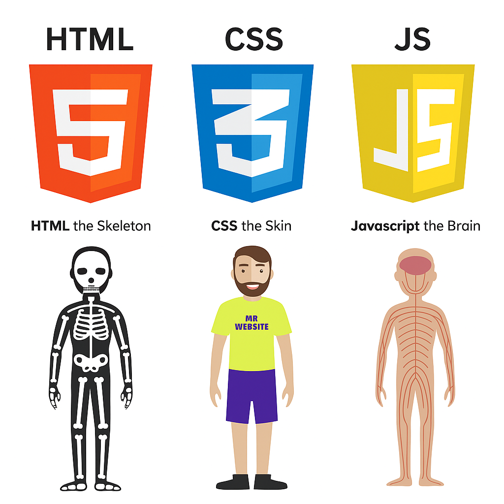

# Orientation

By **Shreyas Panicker**

  

---
layout: side-title
side: l
color: blue-light
titlewidth: is-4
align: cm-cm
transition: slide-up
---

:: title ::

# Vision

:: content ::

Our vision is to be a recognized global player in information technology known for its commitment to high quality technology solutions and develop deep trust in our relationship with our customers. We want to provide high quality services and solutions that are global, flexible, reliable and cost effective.

  

---
layout: side-title
side: l
color: red-light
titlewidth: is-4
align: cm-cm
transition: slide-up
---

:: title ::

# Mission

:: content ::

To provide state-of-the-art Information Technology products and services to global markets and to enable our customers to optimize their business resources using Information Technology for market leadership and global competitiveness.

  

---
layout: side-title
side: l
color: orange-light
titlewidth: is-4
align: cm-cm
---

:: title ::

# Philosophy

:: content ::

To conduct business with integrity and grow with vision and enterprise. To follow ethical business practices and build long term business relationships with customers and honor commitments to clients, shareholders, institutions and employees.

  

---
layout: side-title
side: l
color: purple-light
titlewidth: is-4
align: cm-lm
transition: slide-up
---

:: title ::

# Training

:: content ::

- HR orientation on policies and guidelines
- Coding standards
- HTML, CSS & JavaScript
- Bootstrap
- VueJS
- MongoDB
- ASP .NET Core
- Quality Management System
- Software Testing

  

---
layout: side-title
side: l
color: green-light
titlewidth: is-4
align: cm-lm
---

:: title ::

# Policies & guidelines

:: content ::

  

    <h3>Company Policies</h3>
    <ul>
      <li>Attendance</li>
      <li>Code of conduct</li>
      <li>Leaves & holidays</li>
      <li>Hours of work</li>
    </ul>
  

  

    <h3>HR Policies</h3>
    <ul>
      <li>Harassment policy</li>
      <li>Substance use</li>
      <li>Electronic usage policy</li>
      <li>Employee communication</li>
    </ul>
  

  

---
layout: side-title
side: l
color: yellow-light
titlewidth: is-4
align: cm-lm
---

:: title ::

# Coding standards

:: content ::

<ul>
  <li>Naming conventions</li>
  <li>Formatting & identation</li>
  <li>Comments and documentation</li>
  <li>Code organization</li>
  <li>File and directory structure</li>
</ul>

    

  

---
layout: side-title
side: l
color: cyan-light
titlewidth: is-4
align: cm-cb
---

:: title ::

# HTML, CSS & JS

:: content ::

    

  

---
layout: side-title
align: cm-cm
color: blue-light

---

:: title ::

# Live Demo

:: content ::

<iframe height="300" style="width: 100%;" scrolling="no" title="Untitled" src="https://codepen.io/ShreyasP-Kott/embed/jEWYyXd?default-tab=html&editable=true&theme-id=dark" frameborder="no" loading="lazy" allowtransparency="true" allowfullscreen="true">
  See the Pen <a href="https://codepen.io/ShreyasP-Kott/pen/jEWYyXd">
  Untitled</a> by Shreyas Panicker (<a href="https://codepen.io/ShreyasP-Kott">@ShreyasP-Kott</a>)
  on <a href="https://codepen.io">CodePen</a>.
</iframe>

  

---
layout: side-title
side: l
color: fuchsia-light
titlewidth: is-4
align: cm-lm
---

:: title ::

# Bootstrap

:: content ::

- Ease of use
- Responsive design
- Consistency across browsers
- Customizability
- Large community & support
- Rich set of components

  

