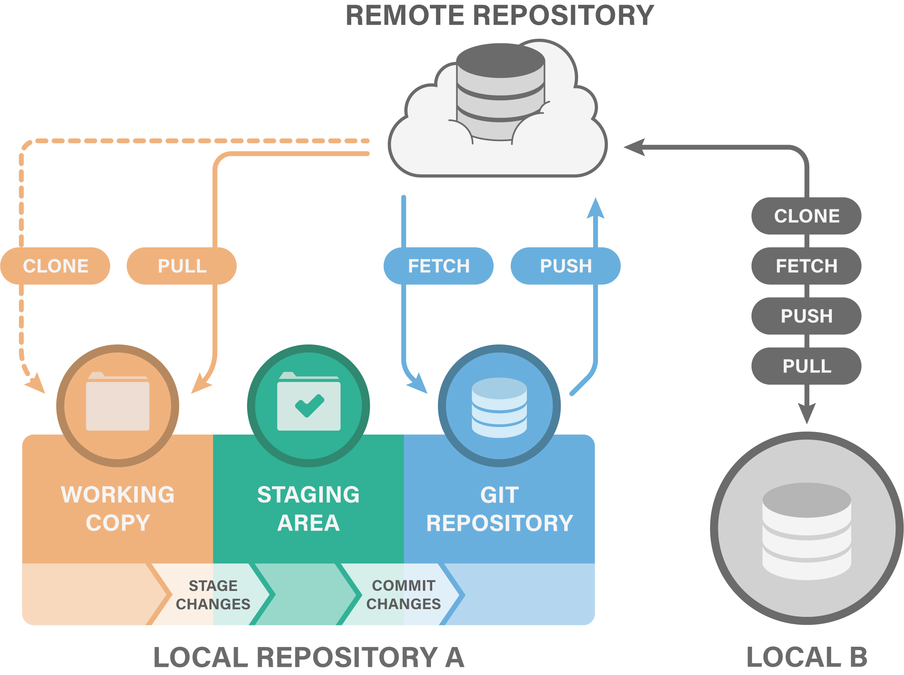
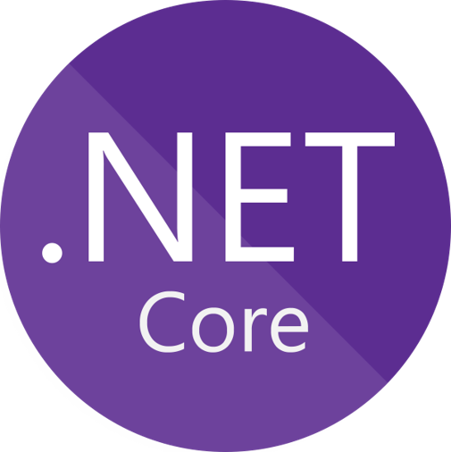
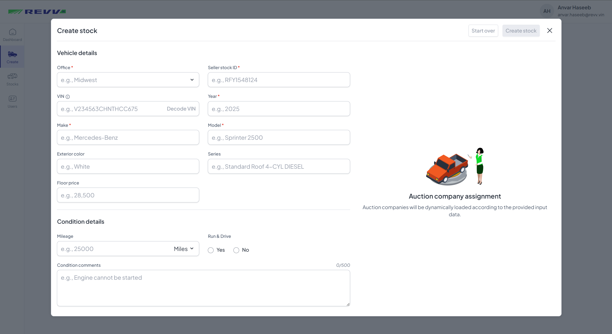
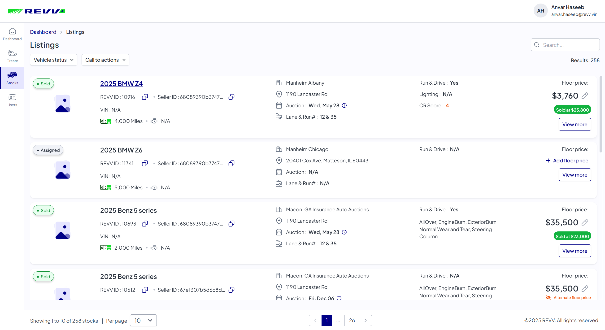
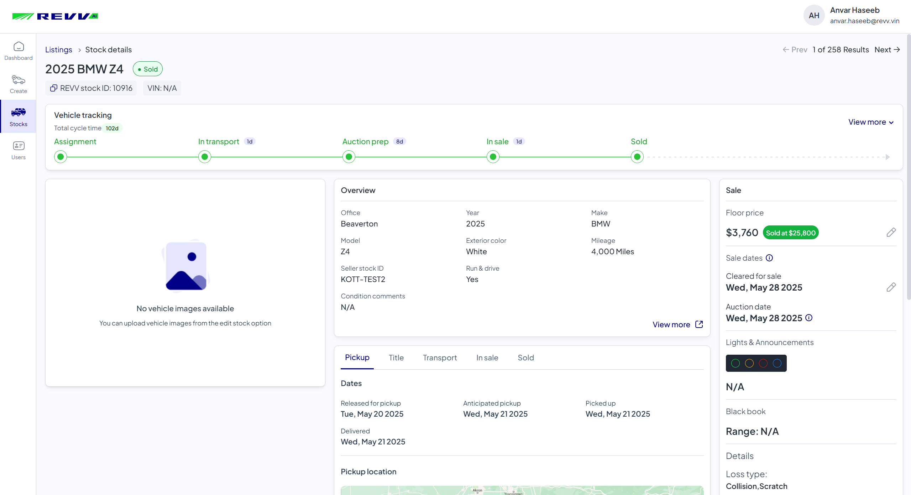
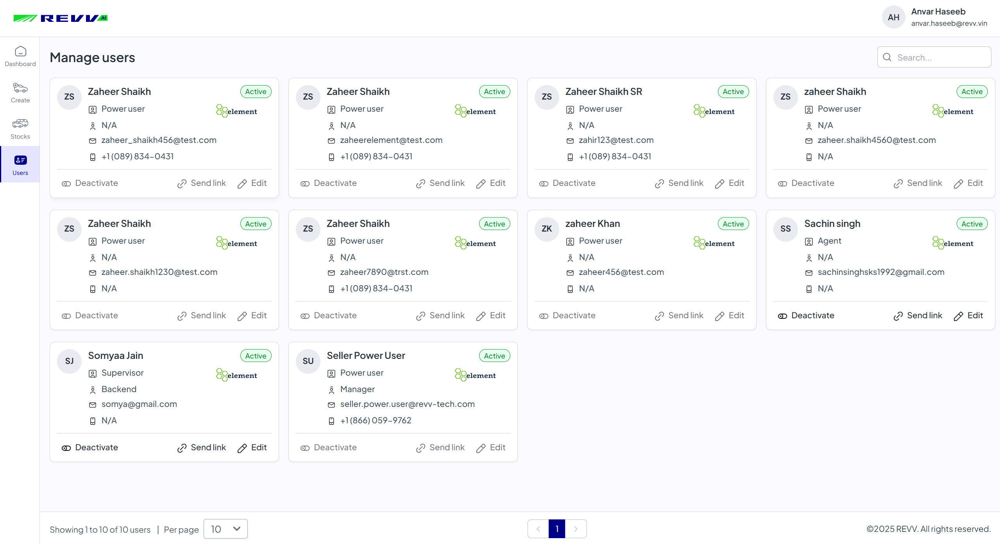
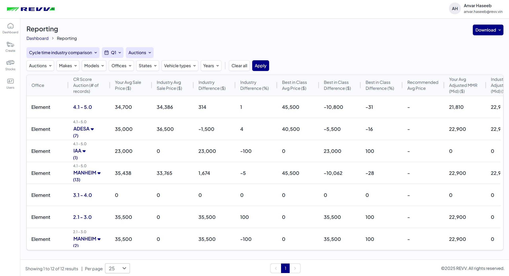

# Orientation

By **Shreyas Panicker**

  

---
layout: side-title
side: l
color: blue-light
titlewidth: is-4
align: cm-cm
transition: slide-up
---

:: title ::

# Vision

:: content ::

Our vision is to be a recognized global player in information technology known for its commitment to high quality technology solutions and develop deep trust in our relationship with our customers. We want to provide high quality services and solutions that are global, flexible, reliable and cost effective.

  

---
layout: side-title
side: l
color: red-light
titlewidth: is-4
align: cm-cm
transition: slide-up
---

:: title ::

# Mission

:: content ::

To provide state-of-the-art Information Technology products and services to global markets and to enable our customers to optimize their business resources using Information Technology for market leadership and global competitiveness.

  

---
layout: side-title
side: l
color: orange-light
titlewidth: is-4
align: cm-cm
---

:: title ::

# Philosophy

:: content ::

To conduct business with integrity and grow with vision and enterprise. To follow ethical business practices and build long term business relationships with customers and honor commitments to clients, shareholders, institutions and employees.

  

---
layout: side-title
side: l
color: purple-light
titlewidth: is-4
align: cm-lm
transition: slide-up
---

:: title ::

# Training

:: content ::

- HR orientation on policies and guidelines
- Coding standards
- HTML, CSS & JavaScript
- Bootstrap
- VueJS
- MongoDB
- ASP .NET Core
- Version Control with Git
- Quality Management System
- Software Testing

  

---
layout: side-title
side: l
color: green-light
titlewidth: is-4
align: cm-lm
---

:: title ::

# Policies & guidelines

:: content ::

  

    <h3>Company Policies</h3>
    <ul>
      <li>Attendance</li>
      <li>Code of conduct</li>
      <li>Leaves & holidays</li>
      <li>Hours of work</li>
    </ul>
  

  

    <h3>HR Policies</h3>
    <ul>
      <li>Harassment policy</li>
      <li>Substance use</li>
      <li>Electronic usage policy</li>
      <li>Employee communication</li>
    </ul>
  

  

---
layout: side-title
side: l
color: yellow-light
titlewidth: is-4
align: cm-lm
---

:: title ::

# Coding standards

:: content ::

- **Naming conventions** like camelCase, PascalCase, snake_case
- **Formatting & indentation** with spaces, tabs, line breaks
- **Comments and documentation** with single-line and multi-line
- **Error handling and debugging** with try-catch blocks, logging
- **Code organization** with DRY, KISS, YAGNI, SOLID principles
- **File and directory structure** with modularization, separation of concerns

  

---
layout: side-title
side: l
color: red-light
titlewidth: is-4
align: cm-lm
transition: slide-up
---

:: title ::

# HTML, CSS & JS

:: content ::

 

HTML (HyperText Markup Language): A markup language used to define the structure and semantics of web content using tags and attributes

 

CSS (Cascading Style Sheets): A stylesheet language used to describe the presentation layer of HTML documents using selectors and properties

 

JavaScript: A high-level programming language that enables client-side logic on web pages using DOM manipulation, event handling, and API communication.

  

---
layout: side-title
side: l
color: cyan-light
titlewidth: is-4
align: cm-cb
transition: slide-up
---

:: title ::

# Core components of a website

:: content ::

    

  

---
layout: side-title
align: cm-cm
color: blue-light
transition: slide-left
---

:: title ::

# All 3 in action

:: content ::

<iframe height="300" style="width: 100%;" scrolling="no" title="Untitled" src="https://codepen.io/ShreyasP-Kott/embed/jEWYyXd?default-tab=html&editable=true&theme-id=dark" frameborder="no" loading="lazy" allowtransparency="true" allowfullscreen="true">
  See the Pen <a href="https://codepen.io/ShreyasP-Kott/pen/jEWYyXd">
  Untitled</a> by Shreyas Panicker (<a href="https://codepen.io/ShreyasP-Kott">@ShreyasP-Kott</a>)
  on <a href="https://codepen.io">CodePen</a>.
</iframe>

  

---
layout: side-title
side: l
color: fuchsia-light
titlewidth: is-4
align: cm-lb
transition: slide-up
---

:: title ::

# Bootstrap

:: content ::

Bootstrap is a popular open-source front-end framework for developing responsive and mobile-first websites and web applications using pre-designed CSS and JavaScript components.

Why use it?
- Rapid development
- Responsive design
- Consistency across browsers
- Customizability
- Large community & support
- Rich set of components

  

---
layout: default
align: cm-cm
titlewidth: is-1
color: white
transition: slide-left
---

### Bootstrap usage example

<iframe height="90%" style="width: 100%;" scrolling="no" title="Bootstrap Demo" src="https://codepen.io/ShreyasP-Kott/embed/WbrdqQX?default-tab=html&editable=true&theme-id=dark" frameborder="no" loading="lazy" allowtransparency="true" allowfullscreen="true">
  See the Pen <a href="https://codepen.io/ShreyasP-Kott/pen/WbrdqQX">
  Bootstrap Demo</a> by Shreyas Panicker (<a href="https://codepen.io/ShreyasP-Kott">@ShreyasP-Kott</a>)
  on <a href="https://codepen.io">CodePen</a>.
</iframe>

  

---
transition: slide-up
level: 1
---

# Popular UI Frameworks

  

    
    
React

  

  

    
    
Vue

  

  

    
    
Angular

  

  

---
layout: side-title
side: l
color: green-light
titlewidth: is-4
align: cm-lb
transition: slide-up
---

:: title ::

# What Vue brings to the table?

:: content ::

Vue doesn’t replace HTML, CSS, or JS — it enhances them. It gives you a structured, reactive, and component-based way to build UIs.

Why use it?
- Reactive Data Binding
- Component-Based Architecture
- Virtual DOM for Performance
- Declarative Rendering
- Built-in Directives and Reactivity System
- Maintainability and Scalability

  

---
transition: slide-left
---

### Counter Example: Plain JS vs Vue

<iframe height="200" style="width: 100%;" scrolling="no" title="Untitled" src="https://codepen.io/ShreyasP-Kott/embed/RNrQWMK?default-tab=html&editable=true&theme-id=dark" frameborder="no" loading="lazy" allowtransparency="true" allowfullscreen="true">
  See the Pen <a href="https://codepen.io/ShreyasP-Kott/pen/RNrQWMK">
  Untitled</a> by Shreyas Panicker (<a href="https://codepen.io/ShreyasP-Kott">@ShreyasP-Kott</a>)
  on <a href="https://codepen.io">CodePen</a>.
</iframe>
 
<iframe height="200" style="width: 100%;" scrolling="no" title="Untitled" src="https://codepen.io/ShreyasP-Kott/embed/JoGpGjK?default-tab=html&editable=true&theme-id=dark" frameborder="no" loading="lazy" allowtransparency="true" allowfullscreen="true">
  See the Pen <a href="https://codepen.io/ShreyasP-Kott/pen/JoGpGjK">
  Untitled</a> by Shreyas Panicker (<a href="https://codepen.io/ShreyasP-Kott">@ShreyasP-Kott</a>)
  on <a href="https://codepen.io">CodePen</a>.
</iframe>

  

---
layout: side-title
side: l
color: amber-light
titlewidth: is-4
align: cm-lm
transition: slide-up
---

:: title ::

# MongoDB

:: content ::

MongoDB is a NoSQL database designed for storing, querying, and managing large volumes of unstructured or semi-structured data.

Why use it?

- Flexible Schema
- JSON-like Data Model
- High Performance
- Scalability
- Powerful Querying and Indexing
- Great for Modern Architectures

  

---
layout: side-title
side: l
color: violet-light
titlewidth: is-4
align: cm-cm
transition: slide-up
---

:: title ::
# MongoDB Document Structure

:: content ::

  

---
layout: side-title
side: l
color: cyan-light
titlewidth: is-4
align: cm-cm
transition: slide-left
---

:: title ::
# Aggregation Pipeline

:: content ::

 

Think of it like a data processing pipeline — your documents flow through multiple stages, and each stage transforms the data in some way before passing it to the next stage.

  

---
layout: side-title
side: l
color: blue-light
titlewidth: is-4
align: cm-cl
transition: slide-up
---

:: title ::
# ASP .NET Core

:: content ::
 

ASP.NET Core is a modern, open-source, cross-platform framework developed by Microsoft for building web applications, APIs, and microservices.

 
Why use it?

- High Performance
- Cross-Platform
- Dependency Injection (DI) Built-in
- Easy Integration with Frontend Frameworks
- Modern Security
- Cloud-Ready & Microservices Friendly

  

---
layout: side-title
side: l
color: amber-light
titlewidth: is-4
align: cm-lm
transition: slide-up
---

:: title ::
# OOP's Concepts

:: content ::

 

Encapsulation — ( Data hiding ) — using access modifiers like private, public, protected

 

Abstraction — ( Showing only what’s necessary ) — using abstract classes or interfaces

 

Inheritance — ( Reusing code ) — promotes heirarchy

 

Polymorphism — ( Many forms ) — by method overriding (runtime polymorphism) or method overloading (compile-time).

  

---
layout: side-title
side: l
color: green-light
titlewidth: is-4
align: cm-lm
transition: slide-up
---

:: title ::
# Dependency Injection

:: content ::

 

Design pattern where a class receives its dependencies from an external source rather than creating them itself. Instead of a class being responsible for creating the objects it needs to function, those objects are "injected" into it, typically through its constructor or setter methods.

  

---
layout: side-title
side: l
color: red-light
titlewidth: is-4
align: cm-lm
transition: slide-left
---

:: title ::
# Onion Architecture

:: content ::

 

Onion Architecture is a software architecture pattern that aims to improve maintainability, testability, and separation of concerns by organizing code into layers with clear dependencies pointing inward only (towards the core).

  

---
layout: side-title
side: l
color: teal-light
titlewidth: is-4
align: cm-lm
transition: slide-left
---

:: title ::
# Version Control with Git

:: content ::

 

- Keeps a history of changes

- Allows team collaboration

- Enables safe experimentation with branches

- Provides backup through remote repositories (e.g., GitHub)

  

---
layout: side-title
side: l
color: violet-light
titlewidth: is-4
align: cm-lm
transition: slide-left
---

:: title ::
# Quality Management System

:: content ::

### Policies
 

To provide software products & services to clients and partners with completeness in solution, consistency in delivery, and excellence in quality.

 

Be flexible and proactive in approach and honor customer needs, time and budget.

 

To ensure that the needs and expectations of all internal and external interested parties of the organization are fulfilled.

  

---
layout: side-title
side: l
color: cyan-light
titlewidth: is-4
align: cm-lm
transition: slide-up
---

:: title ::
# Software Testing

:: content ::

 

Unit Testing — Tests indiviual components or modules

Integration Testing — Verifies the interactions and interfaces between integrated modules or components

Smoke Testing — A quick, high-level test to ensure the most critical functions of a build are working

System Testing — Evaluates the complete system to ensure it meets specified requirements and functions as a whole

Regression Testing — Ensures that new changes or bug fixes do not negatively impact existing functionality

User Acceptance Testing (UAT) — The final stage, where end-users test the software in a real-world

  

---
layout: side-title
side: l
color: amber-light
titlewidth: is-4
align: cm-lm
transition: slide-left
---

:: title ::
# Software Testing Techniques

:: content ::

 

Black-Box Testing — The tester has no knowledge of the internal code structure and focuses on validating the functionality based on specifications

 

White-Box Testing — The tester has full access to the source code and uses this knowledge to design test cases that verify the internal logic

 

Gray-Box Testing — A combination of black-box and white-box testing, where the tester has partial knowledge of the internal structure

  

---
layout: side-title
side: l
color: green-light
titlewidth: is-4
align: cm-lm
transition: slide-up
---

:: title ::
# Project

:: content ::

 

 

Vision — Transforming automotive remarketing through artificial intelligence and advanced digital workflows.

 

Mission — Establish REVV's vision as our guiding mission and align short-term goals as building blocks to achieve it

  

---
transition: slide-left
level: 1
---

# Tech Stack of REVV

  

    
    
Frontend

  

  

    
    
Backend

  

  

    
    
Database

  

  

---
layout: side-title
side: l
color: blue-light
titlewidth: is-4
align: cm-lm
transition: slide-up
---

:: title ::
# Create Stock Module

:: content ::

 

 

  

---
layout: side-title
side: l
color: green-light
titlewidth: is-4
align: cm-lm
transition: slide-up
---

:: title ::
# Stock Listing Module

:: content ::

 

 

  

---
layout: side-title
side: l
color: amber-light
titlewidth: is-4
align: cm-lm
transition: slide-up
---

:: title ::
# Stock Details Module

:: content ::

 

 

  

---
layout: side-title
side: l
color: cyan-light
titlewidth: is-4
align: cm-lm
transition: slide-up
---

:: title ::
# User Management Module

:: content ::

 

 

  

---
layout: side-title
side: l
color: violet-light
titlewidth: is-4
align: cm-lm
transition: slide-right
---

:: title ::
# Report Module

:: content ::

 

 

  

---
transition: slide-up
level: 1
---

# My contributions - Vehicle Tracker

<video class="w-full object-fit bg-black" autoplay loop muted playsinline>
  <source src="./assets/vehicle-tracker-demo.mp4" type="video/mp4" />
</video>

  

---
transition: slide-up
level: 1
---

# My contributions - Auction Trend Metrics

<video class="w-full object-fit bg-black" autoplay loop muted playsinline>
  <source src="./assets/auction-metrics.mp4" type="video/mp4" />
</video>

  

---
transition: slide-up
level: 1
---

# My contributions - Vehicle Tracker & Tab Scrolling in Mobile
 

  <video class="flex-1 max-w-[48%] h-full object-contain rounded shadow bg-black" autoplay loop muted playsinline>
    <source src="./assets/vehicle-tracker-mobile.mp4" type="video/mp4" />
  </video>

  <video class="flex-1 max-w-[48%] h-full object-contain rounded shadow bg-black" autoplay loop muted playsinline>
    <source src="./assets/tab-toggle.mp4" type="video/mp4" />
  </video>

  

---
transition: slide-up
level: 1
---

# My contributions - Title handling
 
<video class="w-full h-[90%] object-fit bg-black" autoplay loop muted playsinline>
  <source src="./assets/title.mp4" type="video/mp4" />
</video>

  

---
transition: slide-up
level: 1
---

# My contributions - Plug additional details
 
<video class="w-full h-[90%] object-fit bg-black" autoplay loop muted playsinline>
  <source src="./assets/plug.mp4" type="video/mp4" />
</video>

  

---
transition: slide-left
level: 1
---

# My contributions - Title tracker
 
<video class="w-full h-[90%] object-fit bg-black" autoplay loop muted playsinline>
  <source src="./assets/title-tracker.mp4" type="video/mp4" />
</video>

  

---
theme: neversink
layout: cover
---

# Thank you!

By **Shreyas Panicker**

  

